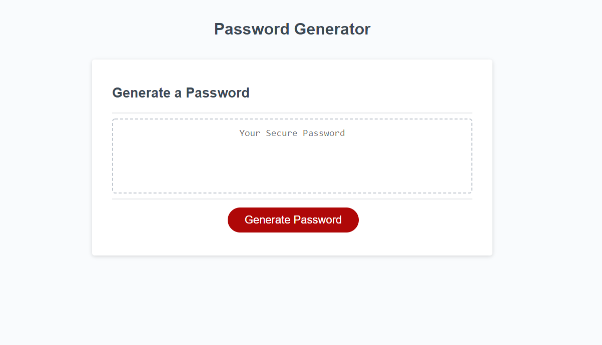

#Password Generator

## Purpose
A website that offers to create a custom password for the user.
User has the option to select from the following options.  
##
    * Uppercase Characters
    * Lowercase Characters
    * Numerical Characters
    * Special Characters
    * Between 8 and 128 characters in length

## Built with
* HTML
* CSS
* Javascript

## Demonstrates the following skills:

## 
    * Working with arrays
    * Working with strings
    * Working with complicated logic
    * Validating user input

## Website
https://tgtiburon.github.io/Password_Generator/

##

Made by Tony Gendreau

